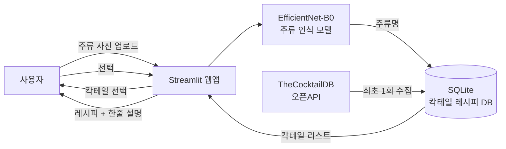

# 🍸 AI 주류 인식 칵테일 레시피 추천 웹앱

> EfficientNet 기반 주류 라벨 인식 + 칵테일 레시피 DB + Streamlit 웹 대시보드

## 프로젝트 개요

주류 사진을 업로드하면 AI가 술의 종류를 자동으로 인식하고,
해당 주류로 만들 수 있는 **칵테일 리스트**를 제안한다.
원하는 칵테일을 선택하면 **재료·레시피·한줄 설명**을 즉시 확인할 수 있는 웹 서비스다.

## 시스템 구조



## 주요 기능

| 기능 | 설명 |
|------|------|
| 주류 인식 | EfficientNet-B0로 주류 종류(보드카·위스키·럼 등) 분류 |
| 칵테일 리스트 추천 | 인식된 주류를 베이스로 만들 수 있는 칵테일 목록 표시 |
| 레시피 상세 조회 | 칵테일 선택 시 재료·분량·제조법·한줄 설명 제공 |
| 칵테일 즐겨찾기 | 마음에 드는 칵테일을 저장하고 나중에 다시 확인 |
| 랜덤 추천 | 오늘의 칵테일 랜덤 추천 기능 |
| 무료 배포 | Streamlit Cloud로 서버 비용 없이 웹 서비스 운영 |

## 기술 스택

| 파트 | 기술 |
|------|------|
| AI / 모델 | Python, PyTorch, EfficientNet-B0, torchvision, Pillow |
| 웹앱 / UI | Streamlit, Plotly |
| 데이터 / DB | SQLite, pandas, TheCocktailDB 오픈API |
| 학습 데이터 | Kaggle Alcohol Bottle Dataset, 직접 수집 |
| 배포 | Streamlit Cloud, GitHub |

## 팀원 및 역할

| 이름 | 역할 | 담당 |
|------|------|------|
| 팀원 A | AI / 모델 | 데이터 수집·전처리, EfficientNet-B0 파인튜닝, 정확도 개선 |
| 팀원 B | 데이터 / 백엔드 | TheCocktailDB API 연동, SQLite DB 설계, 레시피 저장 로직 |
| 팀원 C | 웹앱 / 배포 | Streamlit UI 개발, 레시피 카드 디자인, Streamlit Cloud 배포 |

## 폴더 구조

```
cocktail-vision/
├── app.py                    # Streamlit 메인 앱
├── model/
│   ├── train.py              # EfficientNet-B0 파인튜닝 스크립트
│   ├── predict.py            # 주류 인식 추론 함수
│   └── class_names.json      # 학습된 주류 클래스 목록 (학습 후 생성)
├── data/
│   ├── cocktail_db.py        # TheCocktailDB API 연동 및 SQLite 저장
│   └── cocktail.db           # 칵테일 레시피 DB (자동 생성)
├── utils/
│   └── preprocess.py         # 이미지 전처리 유틸
├── requirements.txt
├── project.md                # 상세 프로젝트 기획서
└── README.md
```

## 실행 방법

```bash
# 1. 의존성 설치
pip install -r requirements.txt

# 2. 칵테일 DB 초기화 (TheCocktailDB API 호출, 무료)
python data/cocktail_db.py

# 3. 모델 학습 (데이터셋 준비 후)
python model/train.py

# 4. 앱 실행
streamlit run app.py
```

## 개발 단계

1. **Phase 1**: 주류 이미지 데이터셋 수집 및 전처리 (Kaggle + 직접 수집)
2. **Phase 2**: EfficientNet-B0 파인튜닝 및 검증 정확도 목표 달성
3. **Phase 3**: TheCocktailDB API 연동 및 SQLite 레시피 DB 구축
4. **Phase 4**: Streamlit 웹 UI 개발 (인식 → 리스트 → 상세 레시피 화면)
5. **Phase 5**: 통합 테스트 및 Streamlit Cloud 배포

## 데이터셋

- **[Kaggle Alcohol Bottle Dataset](https://www.kaggle.com)** — 다양한 주류 라벨 이미지 (무료)
- **[TheCocktailDB 오픈API](https://www.thecocktaildb.com/api.php)** — 칵테일 레시피·재료·설명 (완전 무료)

## 문서

- [상세 프로젝트 기획서 (project.md)](project.md)

## 라이선스

이 프로젝트는 MIT 라이선스를 따릅니다.
