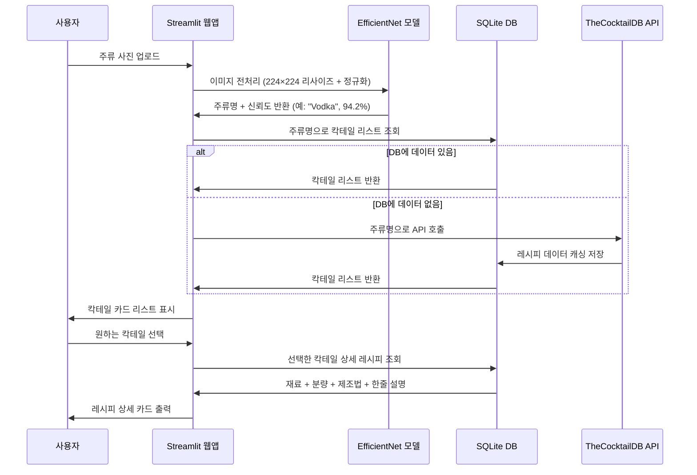

# 🍸 AI 주류 인식 칵테일 레시피 추천 웹앱 - 상세 프로젝트 기획서

## 프로젝트 목적

주류 종류는 다양하지만, 어떤 술로 어떤 칵테일을 만들 수 있는지 모르는 경우가 많다.
바에 가지 않아도 집에 있는 술로 만들 수 있는 칵테일을 즉시 찾아볼 수 있도록,
사진 한 장으로 주류를 인식하고 레시피를 추천해주는 웹 서비스를 개발한다.

## 시스템 구성

- **AI 모델**: EfficientNet-B0 (PyTorch, 주류 이미지 파인튜닝)
- **웹앱**: Streamlit (Python 기반 웹 UI)
- **레시피 DB**: SQLite + TheCocktailDB 오픈API (완전 무료)
- **배포**: Streamlit Cloud (무료, GitHub 연동)

## 상세 데이터 흐름

## 소프트웨어 스택

| 파트 | 라이브러리 / 도구 | 버전 |
|------|----------------|------|
| AI 모델 | PyTorch | 2.0+ |
| AI 모델 | torchvision (EfficientNet-B0) | 0.15+ |
| 이미지 처리 | Pillow, OpenCV | 최신 |
| 웹앱 | Streamlit | 1.32+ |
| 시각화 | Plotly | 5.18+ |
| 데이터 처리 | pandas | 최신 |
| DB | SQLite3 (Python 내장) | - |
| API 연동 | requests | 2.31+ |
| 배포 | Streamlit Cloud | - |

## 주류 분류 클래스

| 카테고리 | 클래스 예시 |
|---------|-----------|
| 증류주 | Vodka, Whiskey, Rum, Gin, Tequila, Brandy |
| 양조주 | Beer, Wine, Sake, Champagne |
| 리큐르 | Triple Sec, Baileys, Kahlua, Midori |
| 기타 | Vermouth, Bitters, Absinthe |

## 모델 학습 전략

| 항목 | 설정값 |
|------|--------|
| 베이스 모델 | EfficientNet-B0 (ImageNet 사전학습) |
| 학습 데이터 | Kaggle 주류 데이터셋 + 직접 수집 (클래스당 최소 200장) |
| 입력 크기 | 224 × 224 |
| 에폭 | 15 |
| 배치 크기 | 32 |
| 학습률 | 1e-4 (StepLR 스케줄러) |
| 데이터 증강 | RandomCrop, HorizontalFlip, ColorJitter, RandomRotation |
| 목표 정확도 | Val Acc 88% 이상 |

## 칵테일 레시피 DB 구조

| 컬럼 | 타입 | 설명 |
|------|------|------|
| cocktail_id | TEXT | TheCocktailDB 고유 ID |
| name | TEXT | 칵테일 이름 |
| base_spirit | TEXT | 베이스 주류 (Vodka, Rum 등) |
| description | TEXT | 한줄 설명 |
| ingredients | TEXT | 재료 목록 (JSON) |
| instructions | TEXT | 제조 방법 |
| thumbnail_url | TEXT | 대표 이미지 URL |

## 개발 단계

1. **Phase 1**: Kaggle 데이터셋 다운로드 및 클래스별 정리, 데이터 증강 스크립트 작성
2. **Phase 2**: EfficientNet-B0 파인튜닝, 검증 정확도 88% 이상 달성
3. **Phase 3**: TheCocktailDB API 전체 수집 스크립트 작성 및 SQLite 저장
4. **Phase 4**: Streamlit UI 개발 (업로드 → 인식 → 리스트 → 레시피 상세)
5. **Phase 5**: 통합 테스트, 엣지케이스 개선, Streamlit Cloud 배포

## 팀원 및 역할

| 이름 | 역할 | 상세 담당 |
|------|------|---------|
| 팀원 A | AI / 모델 | Kaggle 데이터 전처리, EfficientNet-B0 파인튜닝, 클래스 선정, 정확도 개선 |
| 팀원 B | 데이터 / 백엔드 | TheCocktailDB API 전체 수집, SQLite 스키마 설계, 쿼리 최적화 |
| 팀원 C | 웹앱 / 배포 | Streamlit UI 전체, 레시피 카드 레이아웃, 즐겨찾기 기능, Streamlit Cloud 배포 |

## 기대 효과 및 차별점

| 항목 | 내용 |
|------|------|
| 즉시 활용 | 집에 있는 술 사진만 찍으면 바로 레시피 확인 가능 |
| 완전 무료 | TheCocktailDB는 완전 무료 공개 API (키 불필요) |
| 확장 가능성 | 추후 여러 병 동시 인식 → 가능한 칵테일 교집합 추천으로 확장 가능 |
| 국내화 | 소주·막걸리·한국 주류 클래스 추가 시 국내 시장 특화 가능 |
