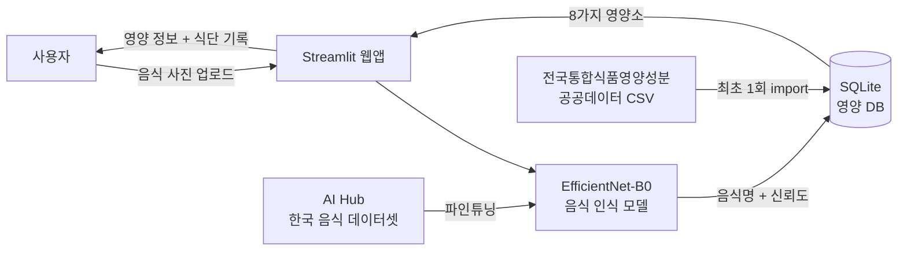
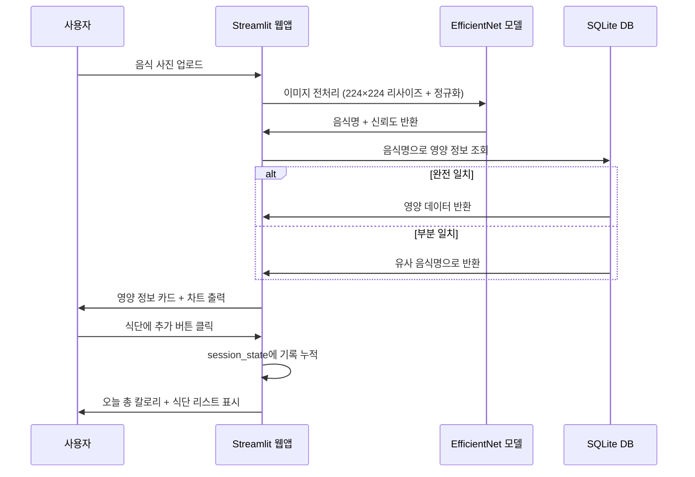
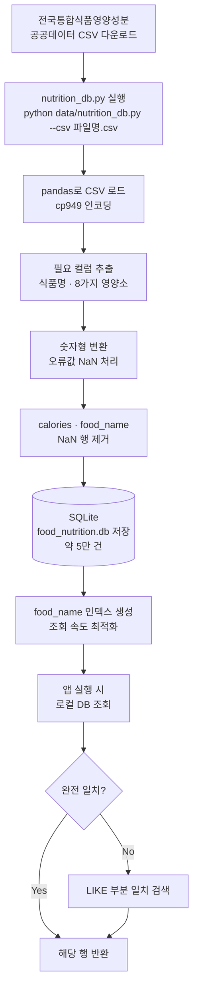

# 🍱 AI 음식 사진 인식 칼로리 계산 웹앱

> EfficientNet 기반 한식 음식 인식 + 공공데이터 영양 DB + Streamlit 웹 대시보드

## 프로젝트 개요

음식 사진을 업로드하면 AI가 한식 종류를 자동으로 인식하고,
전국통합식품영양성분정보 공공데이터 기반으로 **칼로리·탄수화물·당류·단백질·지방·포화지방·식이섬유·나트륨** 정보를 즉시 제공하며,
식단 기록과 영양 균형 통계를 Streamlit 웹 대시보드로 확인할 수 있는 시스템입니다.

---

## 시스템 구조



---

## 데이터 흐름



---

## DB 저장 과정



---

## 주요 기능

| 기능 | 설명 |
|------|------|
| 한식 음식 인식 | EfficientNet-B0로 한식 100종 분류 |
| 영양 정보 조회 | 공공데이터 기반 8가지 영양소 제공 |
| 영양소 시각화 | Plotly 파이·바 차트로 영양 비율 즉시 표시 |
| 식단 기록 | 하루 섭취 음식 누적 저장 및 총 칼로리 합산 |
| 영양 균형 분석 | 일별 영양소 비율 그래프 및 권장량 대비 현황 |
| 무료 배포 | Streamlit Cloud로 서버 비용 없이 웹 서비스 운영 |

## 제공 영양 정보

| 항목 | CSV 컬럼명 | 단위 |
|------|-----------|------|
| 칼로리 | 에너지(kcal) | kcal |
| 탄수화물 | 탄수화물(g) | g |
| 당류 | 당류(g) | g |
| 식이섬유 | 식이섬유(g) | g |
| 단백질 | 단백질(g) | g |
| 지방 | 지방(g) | g |
| 포화지방 | 포화지방산(g) | g |
| 나트륨 | 나트륨(mg) | mg |

## 기술 스택

| 파트 | 기술 |
|------|------|
| AI / 모델 | Python, PyTorch, EfficientNet-B0, torchvision, Pillow |
| 웹앱 / UI | Streamlit, Plotly |
| 데이터 / DB | SQLite, pandas, 전국통합식품영양성분정보 공공데이터 |
| 학습 데이터 | AI Hub 한국 음식 이미지 데이터셋 (한식 150종+) |
| 배포 | Streamlit Cloud, GitHub |

## 폴더 구조

```
food-calorie-ai/
├── app.py                  # Streamlit 메인 앱
├── test_cli.py             # Streamlit 없이 전체 흐름 CLI 확인용
├── model/
│   ├── predict.py          # 추론 함수
│   └── class_names.json    # 학습된 음식 클래스 목록 (학습 후 생성)
├── data/
│   ├── nutrition_db.py     # CSV → SQLite import 및 조회
│   └── food_nutrition.db   # 영양 정보 DB (자동 생성)
├── requirements.txt
├── project.md              # 상세 프로젝트 기획서
└── README.md
```

## 실행 방법

```bash
# 1. 의존성 설치
pip install -r requirements.txt

# 2. 영양 DB 초기화 (CSV 최초 1회)
python data/nutrition_db.py --csv 전국통합식품영양성분정보표준데이터.csv

# 3. 전체 흐름 CLI 빠른 확인 (Streamlit 없이)
python test_cli.py

# 4. 웹앱 실행
streamlit run app.py
```

## 개발 단계

1. **Phase 1**: AI Hub 데이터셋 수집 및 전처리
2. **Phase 2**: EfficientNet-B0 파인튜닝 및 성능 평가
3. **Phase 3**: 공공데이터 CSV → SQLite DB 구축
4. **Phase 4**: Streamlit 웹 UI 개발 및 시각화
5. **Phase 5**: 통합 테스트 및 Streamlit Cloud 배포

## 데이터셋

- **[AI Hub 한국 음식 이미지](https://aihub.or.kr)** — 한식 150여 종, 수십만 장 (무료 신청)
- **[전국통합식품영양성분정보 공공데이터](https://www.data.go.kr/data/15100064/standard.do)** — 약 5만 건, 8가지 영양소 (무료)

## 문서

- [상세 프로젝트 기획서 (project.md)](project.md)

## 라이선스

이 프로젝트는 MIT 라이선스를 따릅니다.
