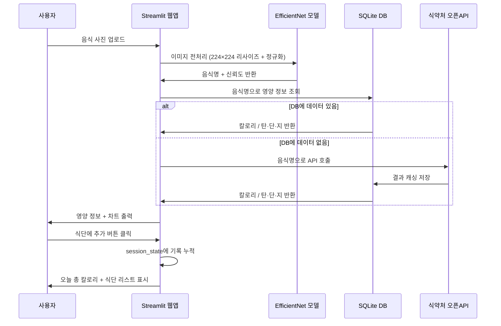

# 🍱 AI 음식 사진 인식 칼로리 계산 웹앱 - 상세 프로젝트 기획서

## 프로젝트 목적

현대인의 식단 관리에 대한 관심은 높지만, 음식별 칼로리를 일일이 검색하고 기록하는 과정이 번거롭다.
이러한 불편함을 없애고자, 음식 사진 한 장만 찍으면 AI가 자동으로 음식을 인식하고
칼로리 및 영양 정보를 즉시 제공하는 웹 서비스를 개발한다.
한식에 특화된 모델을 직접 파인튜닝하여 기존 서비스의 한계를 극복하는 것을 목표로 한다.

## 시스템 구성

- **AI 모델**: EfficientNet-B0 (PyTorch, AI Hub 한식 데이터셋 파인튜닝)
- **웹앱**: Streamlit (Python 기반 웹 UI)
- **영양 DB**: SQLite + 식약처 식품영양성분 오픈API
- **배포**: Streamlit Cloud (무료, GitHub 연동)

## 상세 데이터 흐름

## 소프트웨어 스택

| 파트 | 라이브러리 / 도구 | 버전 |
|------|----------------|------|
| AI 모델 | PyTorch | 2.0+ |
| AI 모델 | torchvision (EfficientNet-B0) | 0.15+ |
| 이미지 처리 | Pillow, OpenCV | 최신 |
| 웹앱 | Streamlit | 1.32+ |
| 시각화 | Plotly | 5.18+ |
| 데이터 처리 | pandas, NumPy | 최신 |
| DB | SQLite3 (Python 내장) | - |
| API 연동 | requests | 2.31+ |
| 배포 | Streamlit Cloud | - |

## 음식 분류 클래스 (예시 100종)

| 카테고리 | 음식 예시 |
|---------|---------|
| 밥류 | 비빔밥, 볶음밥, 김밥, 주먹밥, 쌈밥 |
| 국·찌개 | 된장찌개, 김치찌개, 순두부찌개, 미역국, 설렁탕 |
| 구이 | 삼겹살, 갈비, 불고기, 생선구이, 닭갈비 |
| 면류 | 라면, 냉면, 칼국수, 잡채, 짜장면 |
| 반찬 | 김치, 잡채, 시금치나물, 콩나물, 두부조림 |
| 분식 | 떡볶이, 순대, 튀김, 어묵, 김말이 |

## 모델 학습 전략

| 항목 | 설정값 |
|------|--------|
| 베이스 모델 | EfficientNet-B0 (ImageNet 사전학습) |
| 학습 데이터 | AI Hub 한국 음식 이미지 (클래스당 최소 500장) |
| 입력 크기 | 224 × 224 |
| 에폭 | 10 |
| 배치 크기 | 32 |
| 학습률 | 1e-4 (StepLR 스케줄러) |
| 데이터 증강 | RandomCrop, HorizontalFlip, ColorJitter |
| 목표 정확도 | Val Acc 85% 이상 |

## 개발 단계

1. **Phase 1**: AI Hub 데이터셋 신청 및 다운로드, 클래스 선정, 전처리 스크립트 작성
2. **Phase 2**: EfficientNet-B0 파인튜닝, 검증 정확도 85% 이상 달성
3. **Phase 3**: 식약처 오픈API 키 발급, SQLite DB 설계 및 초기 데이터 수집
4. **Phase 4**: Streamlit UI 개발 (업로드 → 결과 → 식단 기록 → 통계 화면)
5. **Phase 5**: 통합 테스트, 오인식 케이스 개선, Streamlit Cloud 배포

## 팀원 및 역할

| 이름 | 역할 | 상세 담당 |
|------|------|---------|
| 팀원 A | AI / 모델 | AI Hub 데이터 전처리, EfficientNet-B0 파인튜닝, 클래스 선정, 정확도 개선 |
| 팀원 B | 데이터 / 백엔드 | 식약처 오픈API 연동, SQLite DB 설계, 칼로리 계산 로직, API 캐싱 구조 |
| 팀원 C | 웹앱 / 배포 | Streamlit UI 전체, Plotly 차트, session_state 식단 기록, Streamlit Cloud 배포 |

## 기대 효과 및 차별점

| 항목 | 내용 |
|------|------|
| 한식 특화 | 기존 앱(MyFitnessPal 등)의 한식 인식 한계 극복 |
| 비용 0원 | 서버·API 비용 없이 무료 운영 가능 |
| 공식 데이터 | 식약처 공식 DB 사용으로 영양 정보 신뢰도 확보 |
| 확장 가능성 | 추후 식단 추천, 알레르기 필터, 다이어트 목표 설정으로 확장 가능 |
