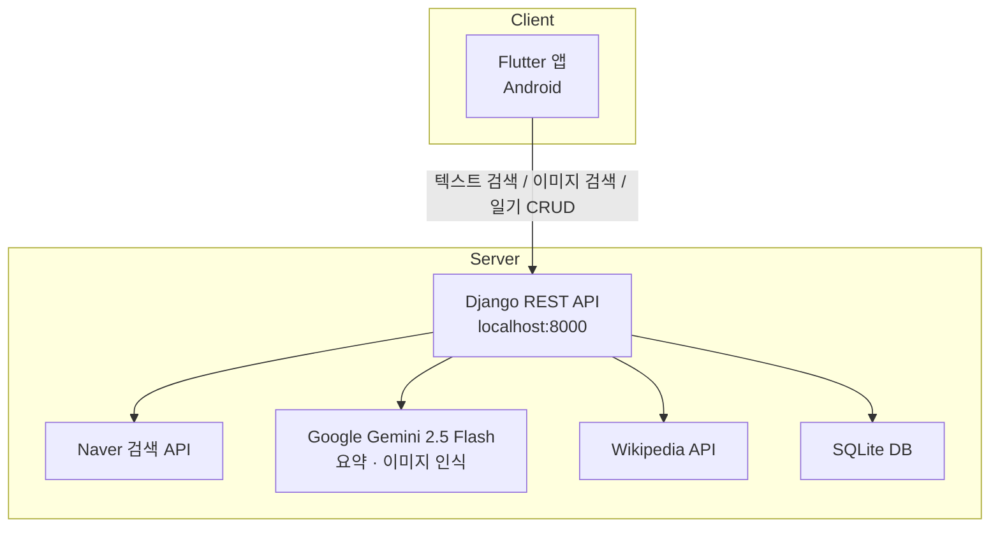
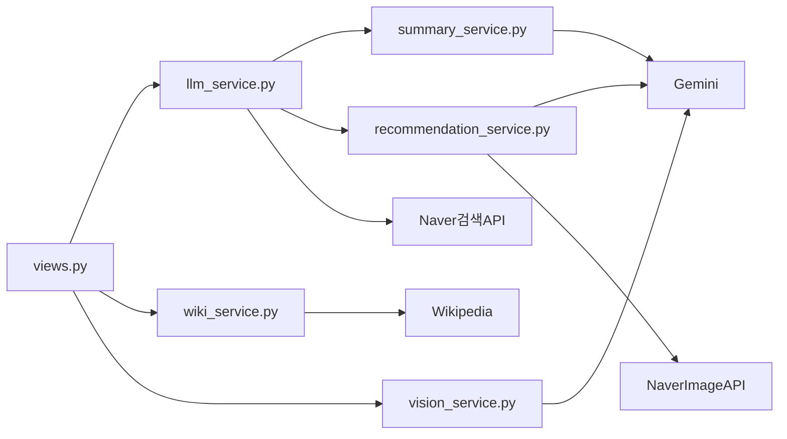
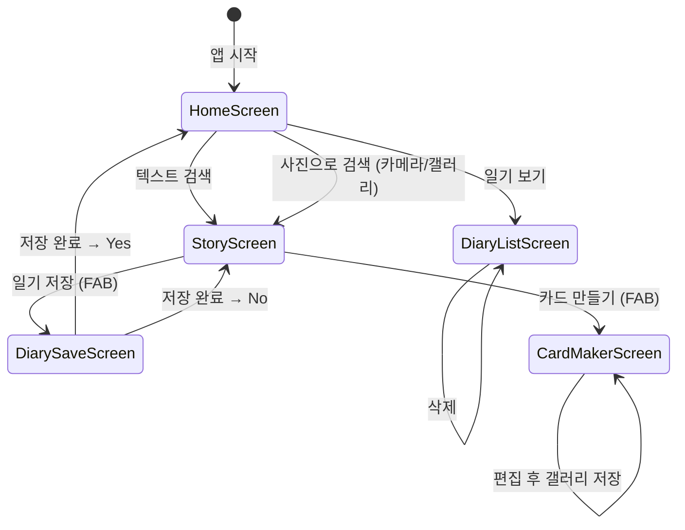

# Food Story — 프로젝트 개요

## 프로젝트 소개

음식 이름을 검색하면 그 음식의 유래, 어울리는 술, 문화적 이야기, 관련 노래, 미디어, 연관 음식 추천 정보를 한눈에 볼 수 있는 앱입니다.
텍스트 검색과 사진 검색을 모두 지원하며, 검색한 내용을 음식 일기로 저장·관리하고, SNS용 음식 카드를 만들어 갤러리에 저장할 수 있습니다.

---

## 시스템 구성



---

## 백엔드 (Django)

### API 엔드포인트

| 메서드 | URL | 설명 |
|---|---|---|
| GET | `/` | 헬스 체크 |
| GET | `/story/{food_name}/` | 음식 스토리 6탭 조회 (추천 탭 포함) |
| POST | `/predict/` | 이미지로 음식명 인식 |
| GET | `/diary/` | 일기 목록 조회 |
| POST | `/diary/` | 일기 저장 |
| DELETE | `/diary/{id}/` | 일기 삭제 |

### 서비스 구조



| 파일 | 역할 |
|---|---|
| `llm_service.py` | Naver 검색 API로 탭별 원문 수집, ThreadPoolExecutor 병렬 처리 |
| `summary_service.py` | Gemini 2.5 Flash로 탭별 맞춤 요약 생성 |
| `recommendation_service.py` | Gemini로 연관 음식 3개 추출 + Naver 이미지 검색으로 사진 URL 수집 |
| `vision_service.py` | Gemini 2.5 Flash로 이미지 → 음식명 인식 |
| `wiki_service.py` | Wikipedia에서 음식 유래 텍스트 수집 |

### 탭별 동작 상세

| 탭 | 검색 쿼리 | 처리 방식 | 결과 형식 |
|---|---|---|---|
| 유래 | `{food} 유래 역사 기원` | Naver 3건 → Gemini 요약 (3~5문장) | 텍스트 |
| 술 | `{food} 어울리는 술 소주 막걸리 맥주 와인 페어링` | Naver 3건 → Gemini 요약 (4~6문장) | 텍스트 |
| 이야기 | `{food} 문화 이야기 속담 에피소드` | Naver 3건 → Gemini 요약 (6~10문장) | 텍스트 |
| 노래 | `{food} 노래` | Naver 7건 → 제목·설명·링크 목록 | 리스트 (링크 클릭 가능) |
| 미디어 | `{food} 등장하는 영화 드라마 책` | Naver 3건 → 제목·설명·링크 목록 | 리스트 (링크 클릭 가능) |
| 추천 | (Naver 텍스트 검색 없음) | Gemini → 연관 음식 3개 + 각 Naver 이미지 검색 | 리스트 (사진+설명 카드) |

> 6개 탭 모두 **ThreadPoolExecutor(max_workers=4)**로 병렬 처리되어 응답 속도를 최적화합니다.

---

## 프론트엔드 (Flutter)

### 화면 흐름



### 주요 파일

| 파일 | 역할 |
|---|---|
| `lib/screens/home_screen.dart` | 텍스트 검색, 사진 검색(카메라/갤러리), 일기 목록 이동 |
| `lib/screens/story_screen.dart` | 6탭 스토리 표시, 추천 카드 렌더링, 로딩 아이콘 애니메이션 |
| `lib/screens/card_maker_screen.dart` | 음식 사진 위 텍스트 최대 5개 · 글자 크기·색상·기울기·위치 편집, 갤러리 저장 |
| `lib/screens/diary_save_screen.dart` | 날짜 자동, 장소 입력 후 일기 저장 |
| `lib/screens/diary_list_screen.dart` | 저장된 일기 목록, 탭별 내용 펼치기, 삭제 |
| `lib/services/api_service.dart` | Django API 통신 (getStory, predictImage, 일기 CRUD) |
| `lib/config.dart` | 서버 주소 설정 (`kBaseUrl`) |

---

## 사용 API 및 기술 스택

| 구분 | 항목 | 용도 |
|---|---|---|
| Backend | Django 4.2 | REST API 서버 |
| Backend | Naver 검색 API | 탭별 웹 문서 검색 |
| Backend | Google Gemini 2.5 Flash | 텍스트 요약 + 이미지 음식 인식 |
| Backend | Wikipedia REST API | 음식 유래 정보 수집 |
| Backend | SQLite | 일기 데이터 저장 |
| Frontend | Flutter 3.41.9 / Dart 3.11.5 | Android 앱 |
| Frontend | image_picker | 카메라/갤러리 이미지 선택 |
| Frontend | url_launcher | 노래·미디어 링크 외부 브라우저 열기 |
| Frontend | gal | 카드 이미지 갤러리 저장 |
| Frontend | http | Django API HTTP 통신 |

---

## 실행 방법

### 사전 조건

- Python 3.9+, venv 활성화
- Flutter 3.41.9
- Android 기기 (USB 디버깅 활성화) 또는 같은 Wi-Fi 환경

### 백엔드 실행

```bash
cd food-story-app
.\venv\Scripts\activate
python manage.py runserver
```

### 프론트엔드 실행 (USB 연결)

```bash
adb reverse tcp:8000 tcp:8000
cd flutter_app
flutter run
```

### 환경변수 (.env)

```
GOOGLE_API_KEY=...       # Gemini 이미지 인식 + 텍스트 요약
NAVER_CLIENT_ID=...      # Naver 검색 API
NAVER_CLIENT_SECRET=...  # Naver 검색 API
```
