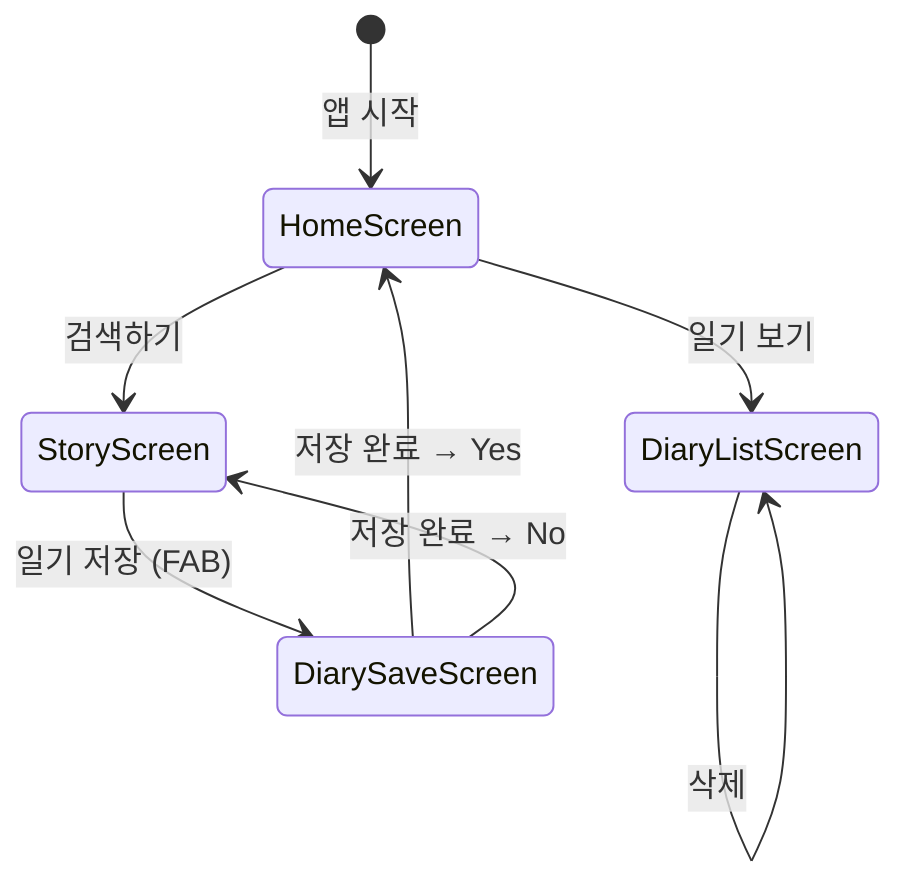
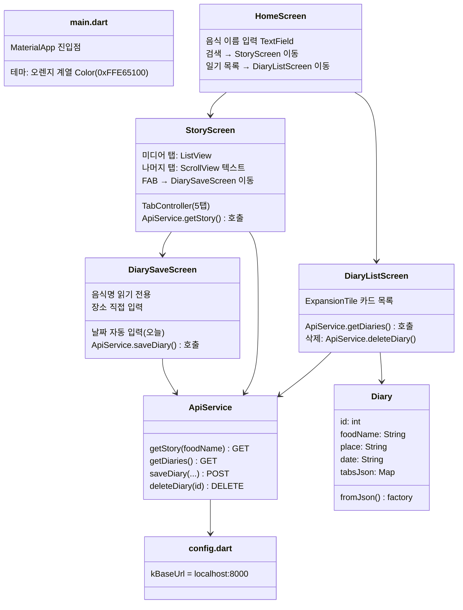
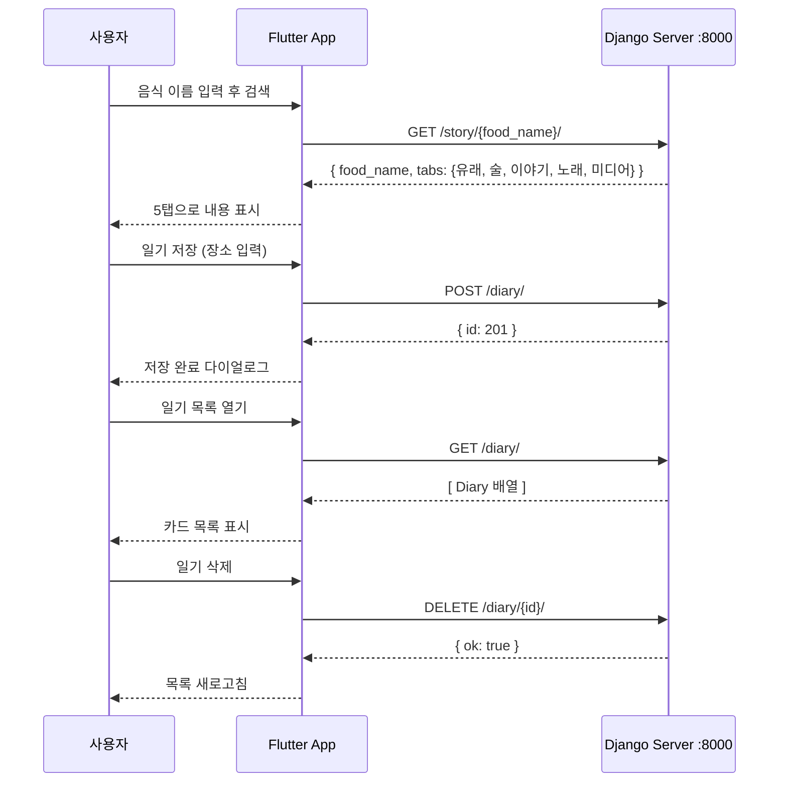

# Food Story App — Flutter 파트 정리

## 프로젝트 개요

음식 이름을 검색하면 Django 백엔드가 AI(Anthropic)와 Wikipedia를 활용해
**유래 / 술 / 이야기 / 노래 / 미디어** 5가지 탭으로 정보를 제공하고,
그 내용을 **음식 일기**로 저장·관리할 수 있는 앱입니다.

---

## 화면 구조 및 흐름

---

## 파일별 역할

---

## API 통신 구조

---

## 주요 기술 스택

| 항목 | 내용 |
|---|---|
| Framework | Flutter 3.41.9 / Dart 3.11.5 |
| 상태 관리 | StatefulWidget (별도 패키지 없음) |
| HTTP 통신 | `http: ^1.1.0` |
| UI 스타일 | Material 3, 오렌지 컬러 테마 |
| 백엔드 연결 | `config.dart`의 `kBaseUrl`로 중앙 관리 |
| 데이터 모델 | `Diary` (id, foodName, place, date, tabsJson) |
